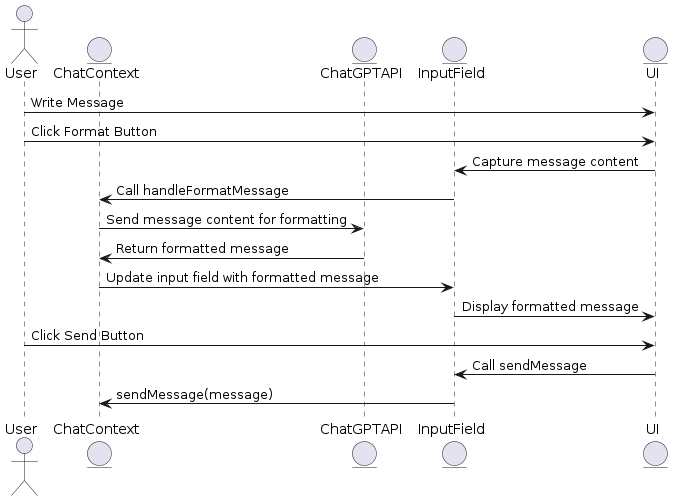

# Chat Application with ChatGPT Integration

## Overview

This chat application has been enhanced with three features using the ChatGPT 4 API:
1. On-Spot Format Message
2. Summarizing Conversation
3. Chat with ChatAI

---

## 1. On-Spot Format Message



This feature allows users to format their casual messages, SMS, or emails into a formal and concise style before sending. 

### Implementation:

#### Frontend

**ChatContext.jsx**

We create a function `handleFormatMessage` that sends the content to the server for formatting. The server responds with the formatted content which is then updated in the input field.

```
const handleFormatMessage = useCallback(async (content) => {
  try {
    const response = await axios.post(`${URL}/api/formatMessage`, { content });
    return response.data.formattedContent;
  } catch (error) {
    console.error("Error formatting message:", error);
    return content; // Fallback to original content
  }
}, []);
```

**InputField.jsx**

We add a button that calls handleFormatMessage when clicked. This updates the input field with the formatted message.

```
<button onClick={async () => {
  const formattedMessage = await handleFormatMessage(message);
  setMessage(formattedMessage);
}}>Format</button>
```

### Backend

**Route in Server**

We create an endpoint /api/formatMessage that handles the formatting request. This calls the ChatGPT API with the message content to get the formatted version.

```
app.post('/api/formatMessage', async (req, res) => {
  const { content } = req.body;
  const formattedContent = await callChatGPTAPI(content, 'formal');
  res.json({ formattedContent });
});
```

---

## 2. Summarizing Conversation


This feature allows users to request a summary of their conversations.

### Frontend

**ChatContext.jsx**

We create a function handleSummarizeConversation that sends a request to the server to summarize the conversation based on the provided query.

```
const handleSummarizeConversation = useCallback(async (query) => {
  try {
    const response = await axios.post(`${URL}/api/summarizeConversation`, { query, messages });
    return response.data.summary;
  } catch (error) {
    console.error("Error summarizing conversation:", error);
    return "Unable to summarize the conversation.";
  }
}, [messages]);
```

**Navbar.jsx**

We add an input field and button for the user to enter their query and request a summary. The summary is displayed in a dynamically expanding box.

```
<input type="text" value={query} onChange={(e) => setQuery(e.target.value)} />
<button onClick={async () => {
  const summary = await handleSummarizeConversation(query);
  setSummary(summary);
  setExpand(true);
}}>Ask ChatAI</button>

{expand && <div className="summary-box">{summary}</div>}
```

### Backend

**Route in Server**

We create an endpoint /api/summarizeConversation that handles the summarization request. This calls the ChatGPT API with the conversation messages to get the summary.

```
app.post('/api/summarizeConversation', async (req, res) => {
  const { query, messages } = req.body;
  const summary = await callChatGPTAPI(messages, 'summarize', query);
  res.json({ summary });
});
```

## 3. Chat with ChatAI


This feature allows users to directly chat with ChatAI, which has access to all messages, SMS, and emails in the conversation.

### Frontend

**ChatContext.jsx**

We create a function handleChatWithAI that sends a message to the server and retrieves the AI's response.

```
const handleChatWithAI = useCallback(async (message) => {
  try {
    const response = await axios.post(`${URL}/api/chatWithAI`, { message, messages });
    return response.data.response;
  } catch (error) {
    console.error("Error chatting with AI:", error);
    return "Unable to get a response from AI.";
  }
}, [messages]);
```

**ChatUserList.jsx**

We add an option in the user list to select "Chat with ChatAI".

```
<li onClick={() => setActiveUser('ChatAI')}>Chat with ChatAI</li>
```

**MessageContent.jsx**

We handle the AI response within the message content. If the active user is ChatAI, we display the AI's response.

```
if (activeUser === 'ChatAI') {
  const aiResponse = await handleChatWithAI(message);
  setMessages((prevMessages) => [...prevMessages, { sender: 'AI', content: aiResponse }]);
} else {
  // Existing message sending logic
}
```

### Backend

**Route in Server**

We create an endpoint /api/chatWithAI that handles the chat requests. This calls the ChatGPT API with the message and conversation history to get the AI's response.

```
app.post('/api/chatWithAI', async (req, res) => {
  const { message, messages } = req.body;
  const aiResponse = await callChatGPTAPI(messages, 'chat', message);
  res.json({ response: aiResponse });
});
```
