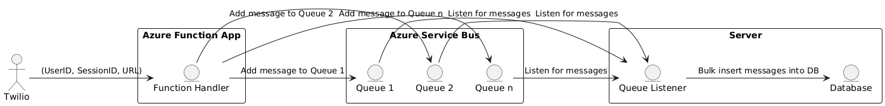

# High Throughput Messaging with Azure Functions and Service Bus

This project focuses on handling high throughput messaging using Azure Functions and Azure Service Bus. Below, we outline the potential challenges, theoretical solutions, steps taken to implement those solutions, and key code snippets.

## Potential Problems

- Concurrency Handling: Multiple messages arriving simultaneously can lead to race conditions, message duplication, or processing errors.
- Efficient Queue Management: A single queue can become a bottleneck under heavy load. Managing multiple queues efficiently is crucial for distributing the workload.
- High Throughput Database Operations: Storing large volumes of data quickly and efficiently can overwhelm the database and impact performance.
- Asynchronous Processing: Ensuring that message processing does not block the main thread is essential for handling concurrent requests smoothly.

## Solutions

### 1. Concurrency Handling

#### Problem: Simultaneous message arrivals can cause race conditions and processing errors.

#### Solution:

- Use Locking Mechanisms: Implement locking mechanisms to ensure that critical sections of code are executed atomically.
- Idempotent Operations: Make operations idempotent to handle duplicate messages without unintended side effects.
- Queue Visibility Timeout: Set a suitable visibility timeout for messages in the queue to prevent multiple instances from processing the same message simultaneously.

### 2. Efficient Queue Management

#### Problem: A single queue may not scale well under high throughput scenarios.

#### Solution:

- Use Multiple Queues: Distribute the workload across multiple queues to prevent bottlenecks and improve scalability.
- Queue Partitioning: Partition queues based on message types, priorities, or load balancing strategies.
- Dynamic Scaling: Configure Azure Service Bus to scale dynamically based on incoming traffic to handle varying loads efficiently.
  
### 3. High Throughput Database Operations

#### Problem: Bulk insertion of messages into the database can overwhelm the database and degrade performance.

#### Solution:

- Bulk Insert Operations: Use database-specific bulk insert operations to efficiently insert large volumes of data in a single transaction.
- Optimized Indexing: Ensure that the database schema is optimized with appropriate indexes to support high write throughput.
- Database Sharding: Consider database sharding to horizontally partition data across multiple servers to distribute the write load.
  
### 4. Asynchronous Processing

#### Problem: Synchronous message processing can block the main thread and hinder scalability.

#### Solution:

- Asynchronous Handlers: Implement message handlers as asynchronous functions to handle multiple messages concurrently.
- Thread Pool Management: Use thread pools or task queues to manage concurrent message processing without blocking resources.
- Non-blocking I/O: Utilize non-blocking I/O operations for database interactions and external API calls to avoid thread blocking.

## Implementation Steps

### Code Snippets

### Concurrency Handling
```
// Example using locking mechanism and idempotent operations
const lock = new AsyncLock();

queueService.addMessageHandler(async (messageData) => {
    await lock.acquire(messageData.from, async () => {
        // Check if message has already been processed
        const alreadyProcessed = await checkIfProcessed(messageData.messageSid);

        if (!alreadyProcessed) {
            // Process the message
            await processMessage(messageData);
            await markAsProcessed(messageData.messageSid);
        }
    });
});
```

### Efficient Queue Management
```
// Example of using multiple queues and dynamic scaling
const queueNames = [process.env.QUEUE_NAME1, process.env.QUEUE_NAME2];

queueNames.forEach(queueName => {
    queueService.addMessageHandler(async (messageData) => {
        // Process message based on the queue name
        await processMessage(messageData, queueName);
    });
});
```

### High Throughput Database Operations
```
// Example of using bulk insert operations
queueService.addMessageHandler(async (messageData) => {
    // Prepare bulk insert operations
    const bulkOps = prepareBulkInsertOperations(messageData);

    // Execute bulk insert in the database
    await db.collection('messages').bulkWrite(bulkOps);
});
```

### Asynchronous Processing
```
// Example of asynchronous message processing
queueService.addMessageHandler(async (messageData) => {
    await processMessageAsync(messageData);
});

async function processMessageAsync(messageData) {
    // Asynchronous processing logic
    await performAsyncOperations(messageData);
}
```

## Conclusion

By addressing these challenges and implementing the suggested solutions using Azure Functions, Azure Service Bus, and efficient coding practices, you can ensure robust and scalable handling of high throughput messaging in your application.
